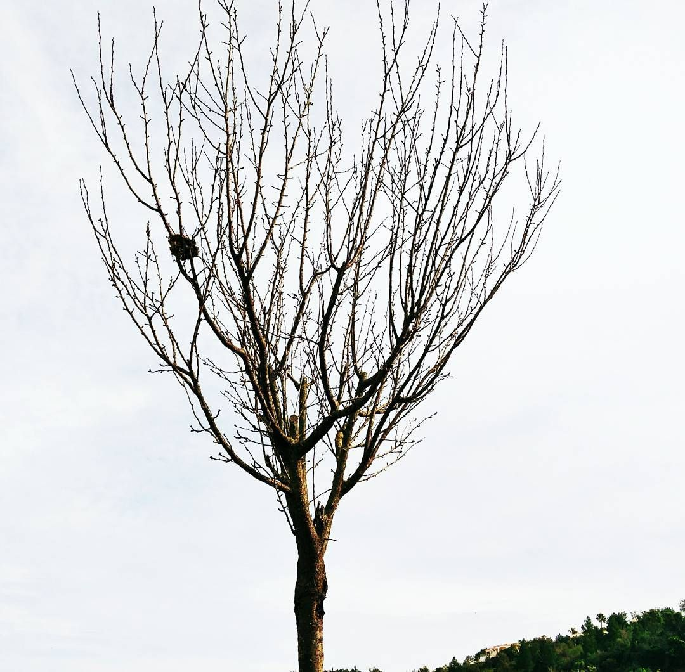

Tem dias que acordo me perguntando o que estou fazendo com minha vida. Me questiono se a vida se resume ao trabalho, à rotina e ao mesmo ciclo de pecado e arrependimento.

Muitas vezes enxergo que estou assim por culpa minha, que isso tudo está acontecendo pois acabo escolhendo pecar. Olho pra mim mesmo e só consigo encontrar desânimo, culpa e tristeza. Minha esperança vêm de saber que já passei por essa estação antes e que com Deus fui capaz de suportá-la. É uma estação muito díficil. Quero me isolar de tudo e de todos. Já não encontro prazer nas coisas ao meu redor. Me questiono incessantemente se estou no lugar certo, se fiz as escolhas certas, se faz sentido eu estar aqui morando sozinho.

Essa estação é muito díficil, mas reconheço e sei que são nesses tempos áridos e secos que o Senhor me mostra o que é o amor. Sei que esse tempo surge pra me descontruir, pra que eu seja moldado novamente. Como se eu fosse um vaso cheio de espinhos e folhas mortas que precisa ser lavado e limpo para que flores possam ser colocadas. É díficil! Muito! Mas em meio a tudo isso, pela graça de Deus, tenho esperança, pois sei que Ele está comigo. Isso é tão confortante.

Como é bom saber que em meio às tempestades da minha vida, que eu mesmo criei, Ele permanece comigo. Ele ainda está no barco. Ele nunca me deixou e sei que nunca me deixará. Sei que essa não será a última vez que me sentirei assim, mas sei que Ele estará comigo em todos momentos.
